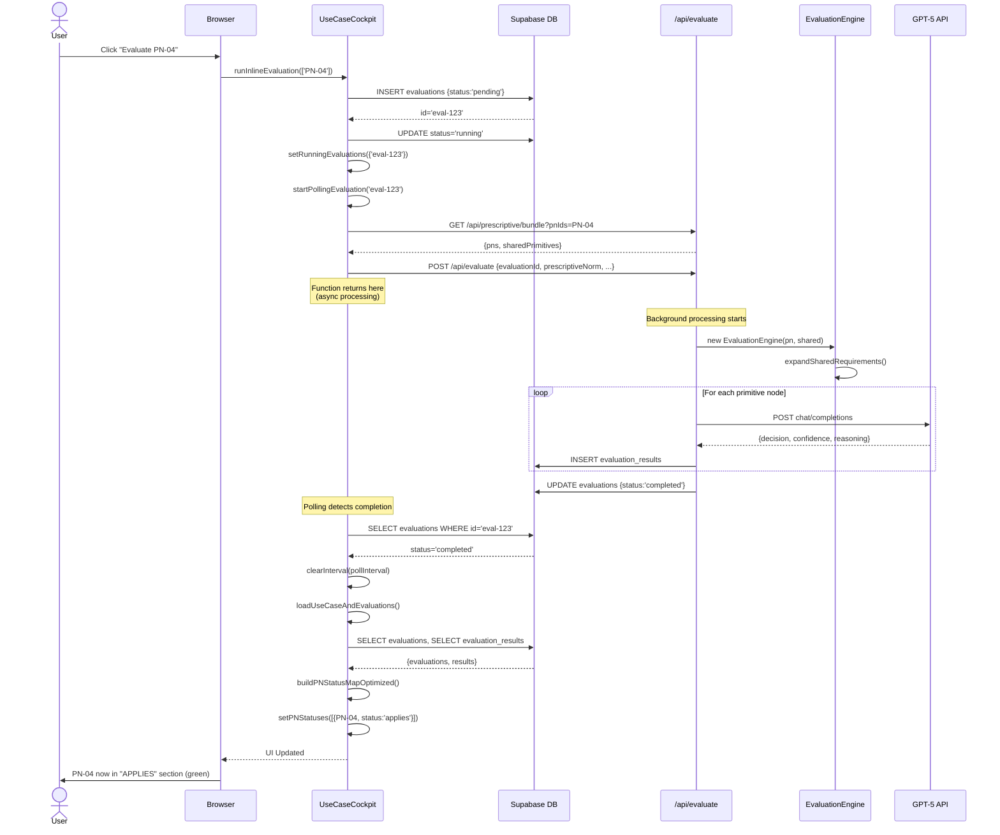
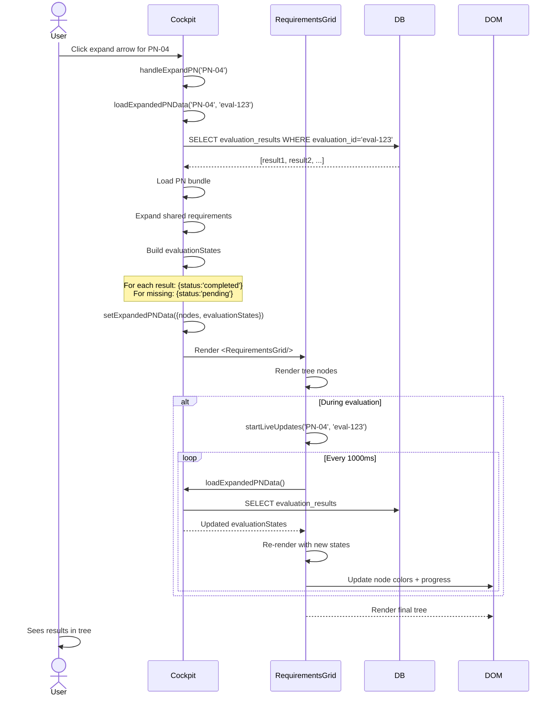
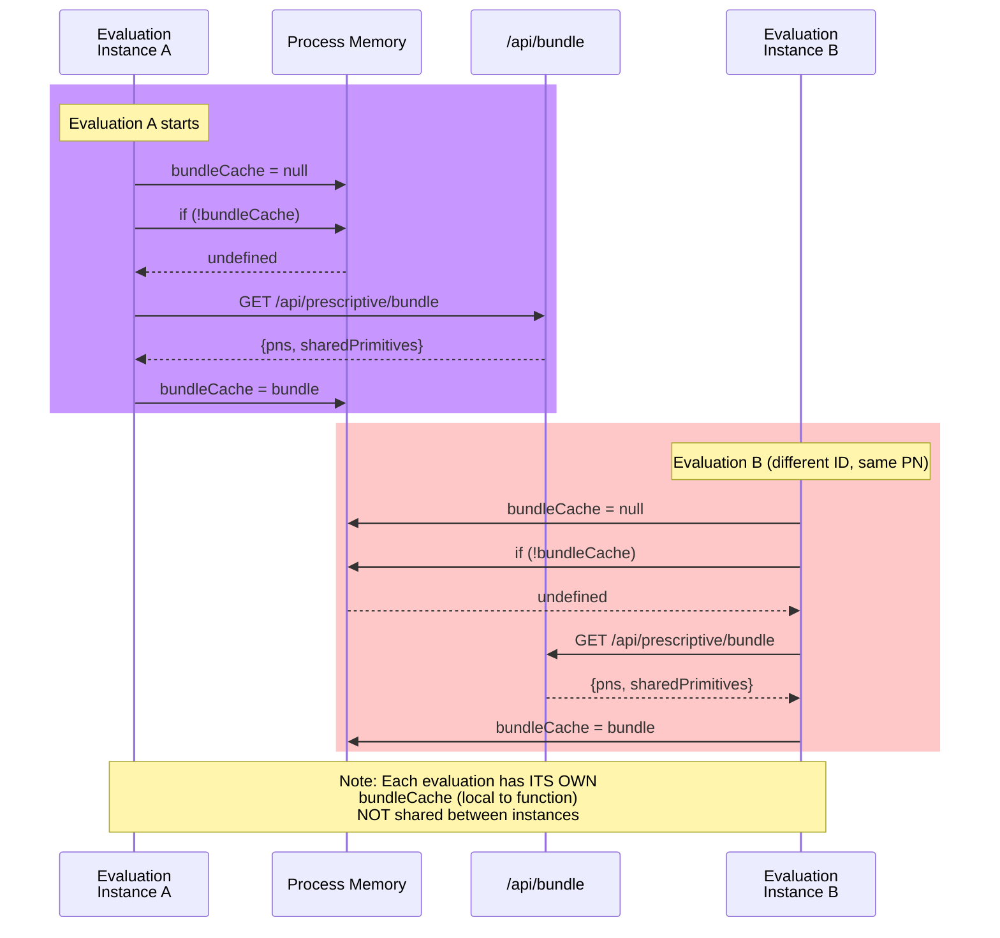
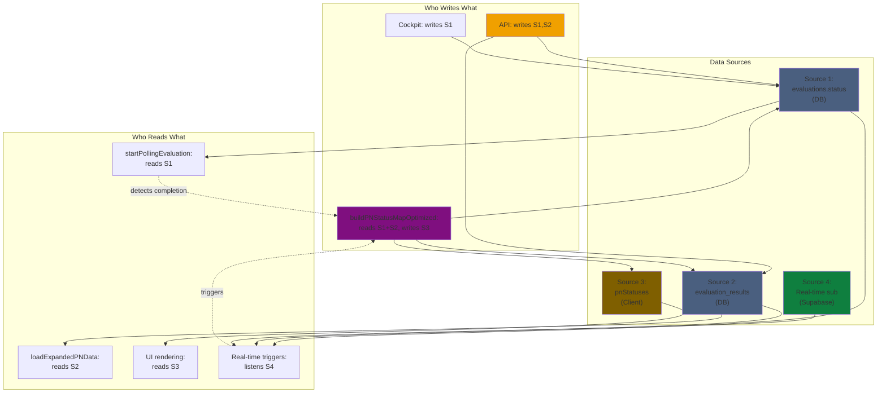
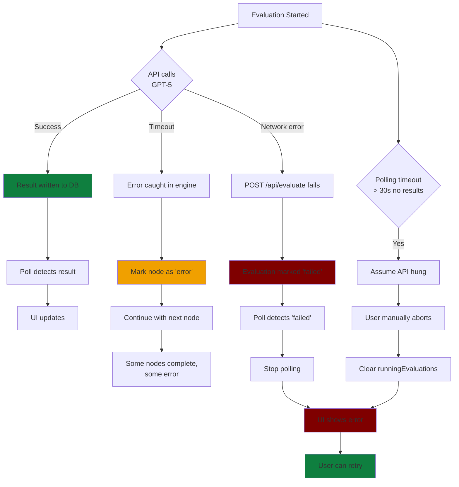

# UseCaseCockpit Sequence Diagrams

## Diagram 1: Complete Evaluation Flow (User Perspective)



---

## Diagram 2: Polling Loop Detail

```mermaid
sequenceDiagram
    participant Cockpit
    participant DB as Supabase
    participant Cache as Memory

    Note over Cockpit: startPollingEvaluation() called
    Cockpit->>Cache: bundleCache = null
    
    loop Every 1000ms
        Cockpit->>DB: SELECT * FROM evaluations WHERE id
        DB-->>Cockpit: {status:'running', ...}
        
        Cockpit->>DB: SELECT node_id FROM evaluation_results
        DB-->>Cockpit: [node1, node2, ...]
        
        alt If bundleCache is empty
            Cockpit->>Cockpit: Fetch /api/prescriptive/bundle
            Cockpit->>Cache: Store in bundleCache
        end
        
        Cockpit->>Cache: Get bundleCache
        Cache-->>Cockpit: bundle
        
        Cockpit->>Cockpit: expandSharedRequirements()
        Cockpit->>Cockpit: Count primitives = 12
        
        Cockpit->>Cockpit: Update evaluationProgress
        Cockpit->>Cockpit: setPNStatuses + triggerRender
        
        alt Status === 'completed'
            Cockpit->>Cockpit: clearInterval()
            Cockpit->>Cockpit: loadUseCaseAndEvaluations()
            break Exit loop
        end
    end
```

---

## Diagram 3: Live Expansion & Tree Update



---

## Diagram 4: Result State Transitions

```mermaid
stateDiagram-v2
    [*] --> Pending: PN loaded
    
    Pending --> Evaluating: User clicks "Evaluate"
    
    Evaluating --> Evaluating: Poll detects results
    note right of Evaluating
        • evaluationProgress updates
        • Progress bar animates
        • Some nodes show results
    end
    
    Evaluating --> Completed: All results written
    note right of Completed
        • evaluationStates has all nodes
        • Tree renders with checkmarks/X
        • Auto-scroll to summary
    end
    
    Pending --> Unevaluated: No evaluation triggered
    
    Evaluating --> Failed: GPT-5 error
    Failed --> Pending: Retry
    
    Completed --> Pending: User clicks "Re-evaluate"
    
    Completed --> [*]: User navigates away
```

---

## Diagram 5: Data Flow Architecture

```mermaid
graph TB
    subgraph UI["User Interface"]
        CP["UseCaseCockpit<br/>Component"]
        RG["RequirementsGrid<br/>Component"]
        TN["TreeNode<br/>Component"]
    end
    
    subgraph Client["Client State"]
        PS["pnStatuses:<br/>PNStatus[]"]
        EP["evaluationProgress:<br/>Map"]
        RS["runningEvaluations:<br/>Set"]
        EPD["expandedPNData:<br/>Tree + States"]
    end
    
    subgraph Backend["Backend Services"]
        DB[(["Supabase DB<br/>(evaluations,<br/>evaluation_results)"])]
        API["API Routes<br/>evaluate<br/>bundle<br/>catalog"]
        ENG["EvaluationEngine"]
        LLM["GPT-5 API"]
    end
    
    subgraph Cache["Local Cache"]
        BC["Bundle<br/>Cache"]
    end
    
    CP -->|loadUseCaseAndEvaluations| DB
    CP -->|runInlineEvaluation| DB
    CP -->|startPollingEvaluation| DB
    CP -->|loadExpandedPNData| DB
    
    DB -->|State| PS
    PS -->|Render| CP
    
    CP -->|POST| API
    API -->|EvaluationEngine| ENG
    ENG -->|Call| LLM
    LLM -->|Result| ENG
    ENG -->|INSERT| DB
    
    CP -->|GET bundle| API
    API -->|Cache| BC
    BC -->|Reuse| CP
    
    CP -->|Polling| EP
    EP -->|Render| CP
    
    CP -->|Expand tree| RG
    RG -->|Render nodes| TN
    TN -->|Show| EPD
    
    DB -->|Real-time| CP
    
    style DB fill:#4a5f7f
    style LLM fill:#f0a000
    style ENG fill:#0f7f3f
    style BC fill:#7f5f00
```

---

## Diagram 6: State Machine - Evaluation Lifecycle

```mermaid
graph LR
    A["1. Create Evaluation<br/>{status: pending}"] 
    B["2. Start Polling<br/>bundleCache = null"]
    C["3. Trigger API<br/>(fire & forget)"]
    D["4. Poll #1<br/>results: 0/12"]
    E["5. API Processing<br/>(GPT-5 calls)"]
    F["6. DB Writes<br/>INSERT results"]
    G["7. Poll #N<br/>results: 5/12"]
    H["8. Final Poll<br/>status: completed"]
    I["9. Stop Polling<br/>Reload UI"]
    J["10. PN Status:<br/>applies/not-applicable"]
    K["11. Display Result<br/>Tree with checksmarks"]
    
    A --> B
    B --> C
    C --> D
    D --> E
    E --> F
    F --> G
    G --|Loop 1s| G
    G --> H
    H --> I
    I --> J
    J --> K
    K --> L["END"]
    
    style E fill:#f0a000
    style F fill:#4a5f7f
    style G fill:#7f7f00
    style J fill:#0f7f3f
    style K fill:#7f0f7f
```



---

## Diagram 7: Bundle Caching Strategy



---

## Diagram 8: Node Status Flow (Single Primitive)

```mermaid
stateDiagram-v2
    [*] --> Pending: Initial state
    
    Pending --> Evaluating: API starts evaluating
    note right of Evaluating
        status: 'evaluating'
        UI shows spinner
        Node highlighted blue
    end
    
    Evaluating --> Completed: GPT-5 returns result
    note right of Completed
        status: 'completed'
        result: {decision, confidence, reasoning}
        DB row inserted
    end
    
    Completed --> Completed: Polling updates state
    note right of Completed
        No change if already completed
        UI shows checkmark/X
    end
    
    Completed --> [*]: Evaluation done
    
    Evaluating --> Error: GPT-5 fails
    Error --> Pending: Retry available
    
    Note: ISSUE: In tree view,<br/>nodes jump from 'pending' to 'completed'<br/>Never show 'evaluating' in loadExpandedPNData()
```

---

## Diagram 9: Multi-Source Truth Resolution



---

## Diagram 10: Error Scenarios



END OF SEQUENCE DIAGRAMS
